# AI Roadmaps: A Learning Project

**AI Roadmaps** is a full-stack web application that helps users create personalized learning roadmaps through an interactive AI-powered agent. 

Built with modern technologies such as **Next.js**, **FastAPI** and **Tailwind CSS**.

---

## Screenshots

Here are some screenshots of the app:

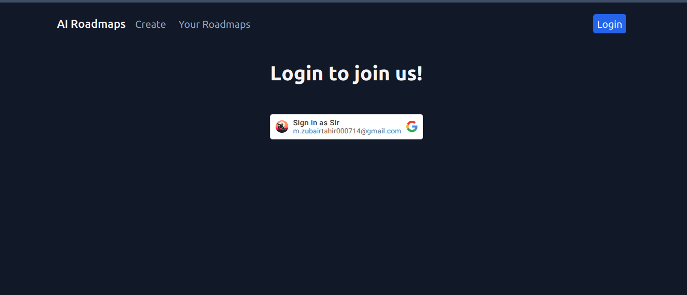
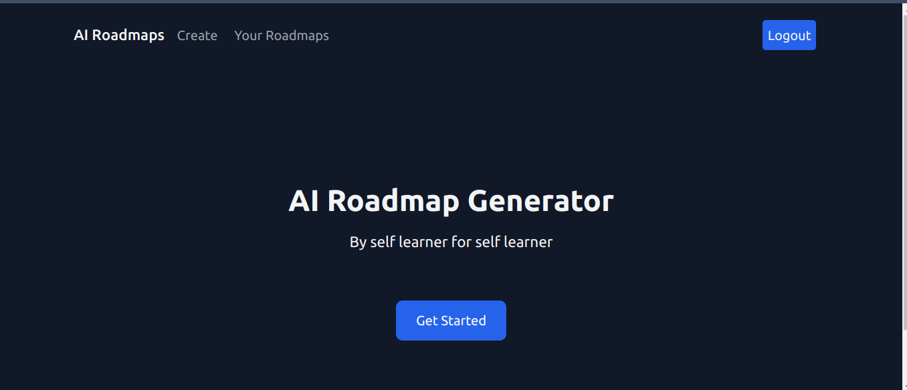
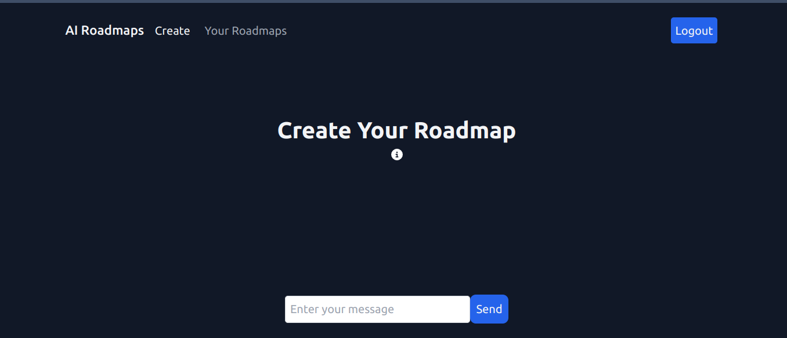
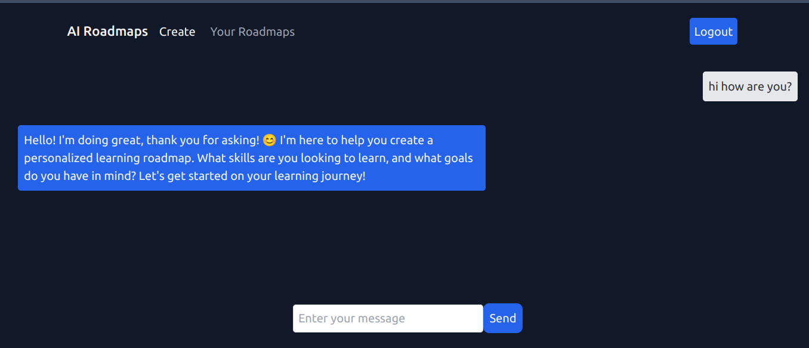
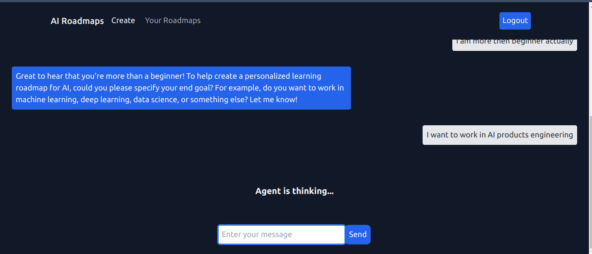
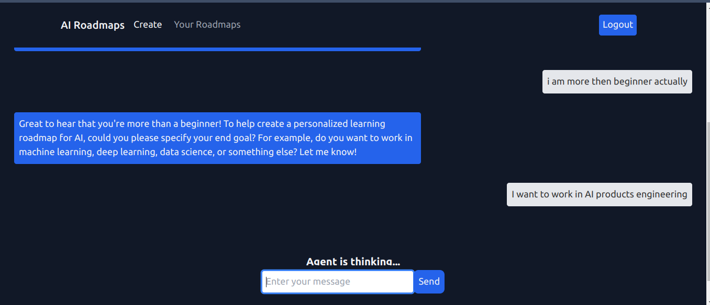
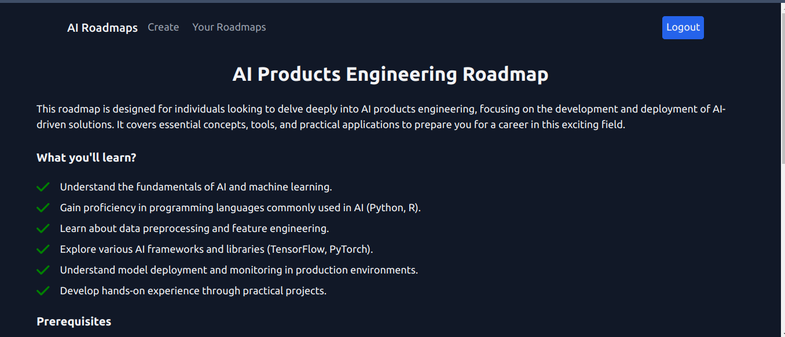
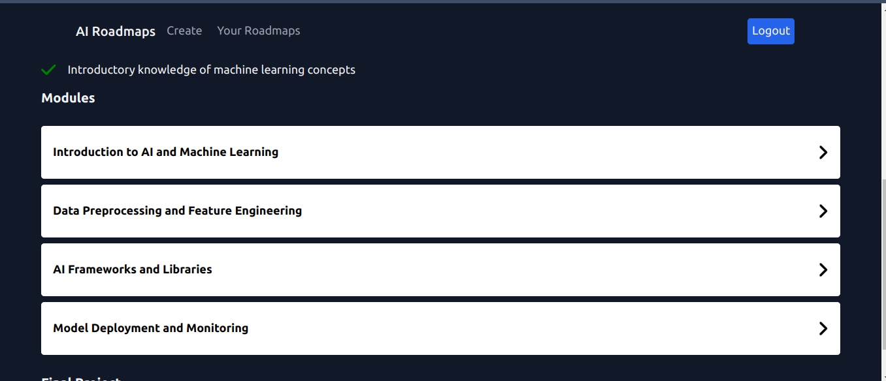
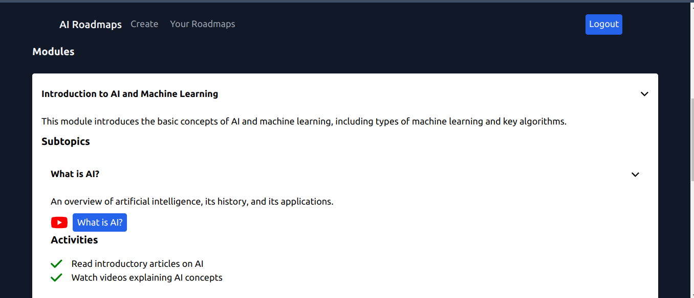
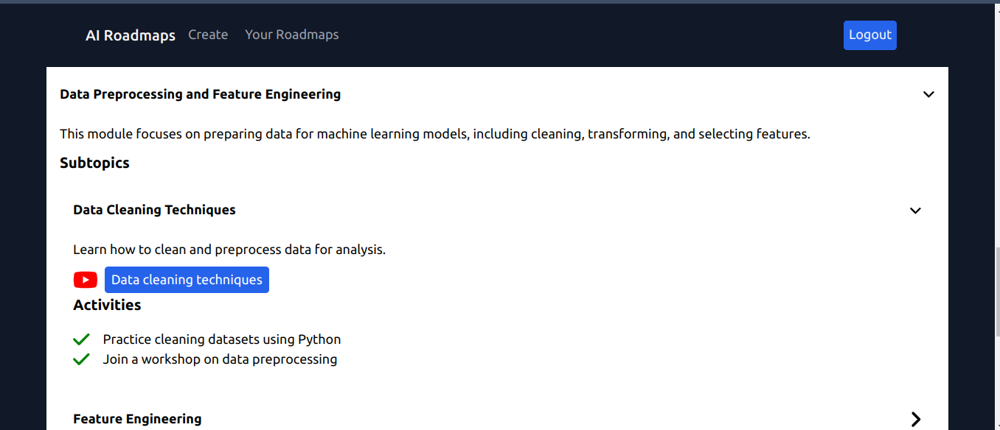
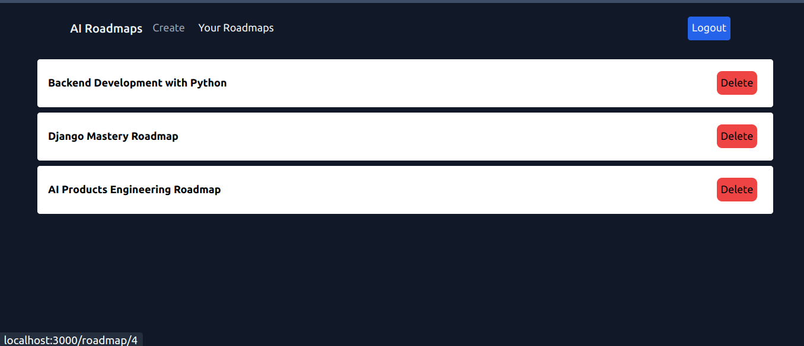

---

## Project Overview

This project is divided into two main parts:

- **Frontend**:  
  Built with **Next.js** and **Tailwind CSS**.

  [See the frontend README](./airoadmaps-frontend/README.md)

- **Backend**:  
  The backend, built using **FastAPI**, **SQLAlchemy**, and **Langchain**.

  [See the backend README](./airoadmaps/README.md)

---

## Key Features

- **User Authentication**:  
  Login with Google OAuth for secure and easy user authentication.

- **Roadmap Management**:  
  Users can view, and delete personalized learning roadmaps.

- **Chat with Agent**:  
  - An AI-powered agent that creates personalized learning roadmaps through conversation.
  - The agent will gather information while chatting with you to help it create the roadmap.
  - Once all the necessary information is collected, the agent will generate a roadmap, and the user will be directed to the roadmap page. 

- **Mobile-First Design**:  
  Optimized for both desktop and mobile devices using **Tailwind CSS**.

---

## Use it
- You are free to modify, adapt, or build upon this project for personal or commercial use, provided that you comply with the GNU General Public License. 

- This includes retaining the original copyright notice, licensing any redistributed versions (modified or not) under the GPL, and providing access to the source code.

---

## Contact

For any questions or contact, please visit:

- **Website**: [https://mzubairtahir.com/](https://mzubairtahir.com/)
